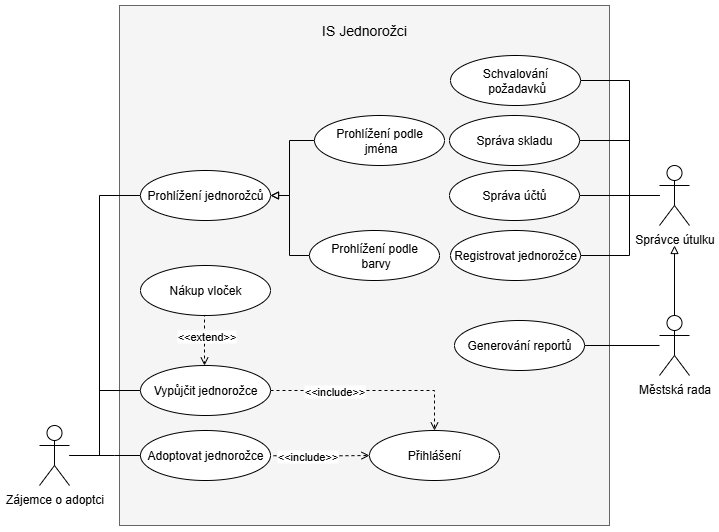
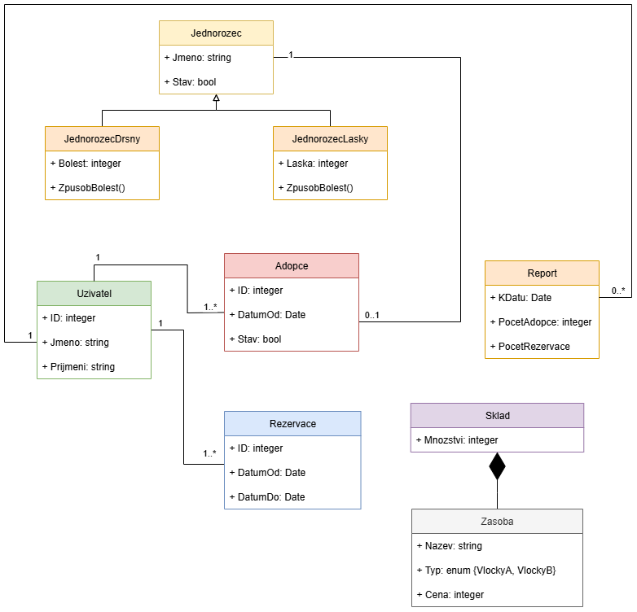
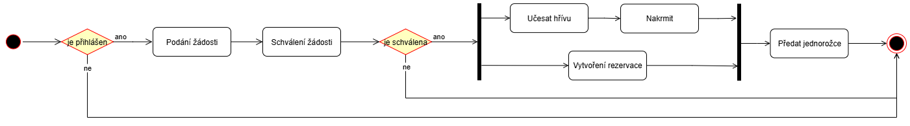
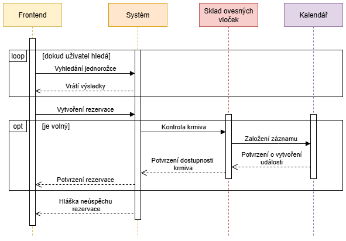
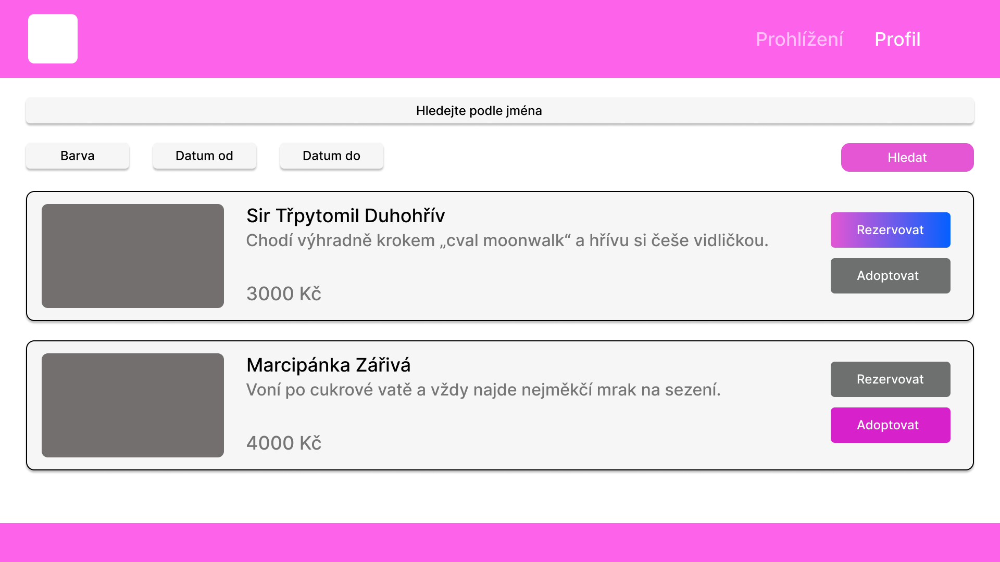
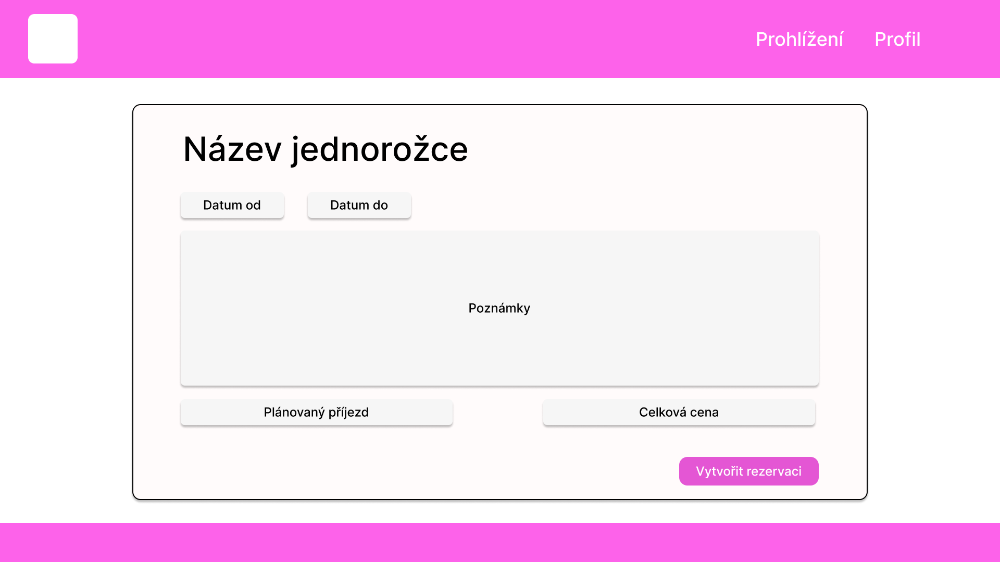
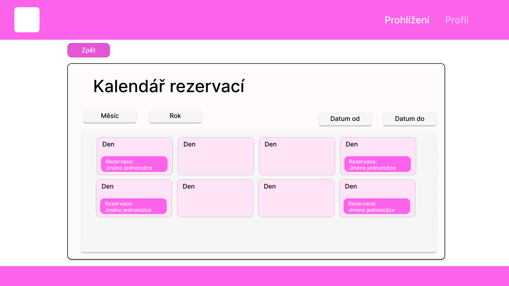

# Aplikace IS Jednorožci

## 1. Diagram případů užití

## 2. Diagram tříd

## 3. Diagram aktivit

##  4. Diagram sekvencí

##  5. Vizuální prototyp

### 5.1 Prohlížení

### 5.2 Formulář rezervace

### 5.3 Uživatelský kalendář rezervací

### 5.3 Odkaz na projekt v nástroji Figma

https://www.figma.com/design/1DKO7vdSyRnocTUI0nM3bq/SZZ-VB-navrh?node-id=1-3&t=axeYrTN8sGBktu68-1

### 5.4 Odkaz na jednoduchý prototyp v nástroji Figma

https://www.figma.com/proto/1DKO7vdSyRnocTUI0nM3bq/SZZ-VB-navrh?node-id=1-3&t=L78jUJpoVwEBf9w0-1
